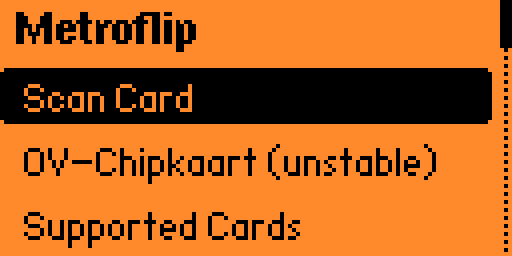

# Metroflip
Metroflip is a multi-protocol metro card reader app for the Flipper Zero, inspired by the Metrodroid project. It enables the parsing and analysis of metro cards from transit systems around the world, providing a proof-of-concept for exploring transit card data in a portable format. Please join the server [here](https://discord.gg/NR5hhbAXqS) if you have any questions for me.

# Author
[@luu176](https://github.com/luu176)

---



# Setup Instructions

## Using the Latest Release
1. Download the `.fap` file from the [Releases section](https://github.com/luu176/Metroflip/releases).
2. Drag and drop the `.fap` file into the `apps` folder on your Flipper Zero's SD card.

## Manual Build Instructions
To build Metroflip manually, follow these steps:

1. **Install Git**  
   Download and install Git on your Windows computer.  
   Run the first command:  

```git clone https://github.com/luu176/Metroflip.git```

2. **Navigate to the Project Folder**  
Run the second command:  

```cd Metroflip```

3. **Install Python**  
Download and install Python from the [official website](https://www.python.org).  

4. **Install UFBT**  
Run the third command to install UFBT:  

```pip install ufbt```

5. **Update and Build the Project**  
Run the following commands in order:  

```ufbt update```
```ufbt fap_metroflip```

6. **Connect Your Flipper Zero**  
Ensure your Flipper Zero is connected via USB and close the QFlipper application (if it’s open).  

7. **Launch the Build**  
Run the final command:  

```ufbt launch```

---

# Metroflip - Card Support TODO List

This is a list of metro cards and transit systems that need support or have partial support.

## ✅ Supported Cards
- [x] **Rav-Kav**  
- Status: Partially Supported
- [x] **Charliecard**  
- Status: Fully supported.
- [x] **Metromoney**  
- Status: Fully supported.
- [x] **Bip!**  
- Status: Fully supported.
- [x] **Navigo**  
- Status: Fully supported.
- [x] **Troika**
- Status: Fully supported.
- [x] **Clipper**
- Status: Fully supported.
- [x] **myki**
- Status: Fully supported.
- [x] **Opal**
- Status: Fully supported.
- [x] **ITSO**
- Status: Fully supported

---

# Credits
- **App Author**: [@luu176](https://github.com/luu176)
- **Charliecard Parser**: [@zacharyweiss](https://github.com/zacharyweiss)
- **Rav-Kav Parser**: [@luu176](https://github.com/luu176)
- **Navigo Parser**: [@luu176](https://github.com/luu176), [@DocSystem](https://github.com/DocSystem)
- **Metromoney Parser**: [@Leptopt1los](https://github.com/Leptopt1los)
- **Bip! Parser**: [@rbasoalto](https://github.com/rbasoalto), [@gornekich](https://github.com/gornekich)
- **Clipper Parser**: [@ke6jjj](https://github.com/ke6jjj)
- **Troika Parser**: [@gornekich](https://github.com/gornekich)
- **Myki Parser**: [@gornekich](https://github.com/gornekich)
- **Opal Parser**: [@gornekich](https://github.com/gornekich)
- **ITSO Parser**: [@gsp8181](https://github.com/gsp8181), [@hedger](https://github.com/hedger), [@gornekich](https://github.com/gornekich)
- **Info Slaves**: [@equipter](https://github.com/equipter), [TheDingo8MyBaby](https://github.com/TheDingo8MyBaby)

---

### Special Thanks
Huge thanks to [@equipter](https://github.com/equipter) for helping out the community!
